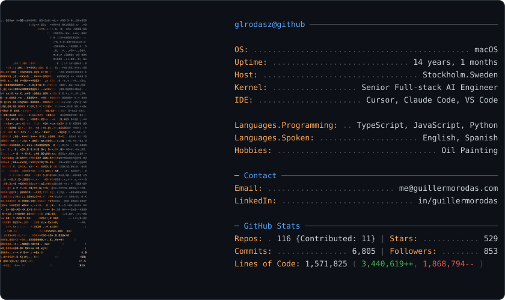

<picture>
  <source media="(prefers-color-scheme: dark)" srcset="dark_mode.svg">
  <source media="(prefers-color-scheme: light)" srcset="light_mode.svg">
  
</picture>

<details>
<summary>How this card is built</summary>

<br>

`dark_mode.svg` and `light_mode.svg` above are generated by the `profilecard` package
and refreshed daily by [`.github/workflows/update.yml`](.github/workflows/update.yml).
The runtime is stdlib-only — no dependencies to install for the daily run.

```bash
make install   # pip install -e ".[dev]"
make update    # regenerate both SVGs (uses `gh auth token`)
make test      # pytest
```

**Editing the card's text** — everything personal (role, location, languages, contact,
career start) lives in [`profile.toml`](profile.toml). Change it there; no code edit
needed.

**Layout**

| Path | Purpose |
| --- | --- |
| `src/profilecard/config.py` | `.env` loading, tokens, paths |
| `src/profilecard/profile.py` | `profile.toml` → `ProfileData` |
| `src/profilecard/github.py` | REST/GraphQL client |
| `src/profilecard/stats.py` | repo, star, follower and commit counts |
| `src/profilecard/loc.py` | incremental lines-of-code walk + hashed cache |
| `src/profilecard/layout.py` | the text column (key/value rows, rules) |
| `src/profilecard/art.py` | the glyph grid, read from `art.json` |
| `src/profilecard/render.py` | palettes and SVG assembly |
| `src/profilecard/cli.py` | `python -m profilecard` |
| `tools/make_art.py` | one-off: portrait photo → `art.json` (needs `pip install -e ".[art]"`) |

**Two tokens by design** — the Actions `GITHUB_TOKEN` gives the contribution-style commit
count, while a PAT (`ACCESS_TOKEN`) sees private repos for the repo list and LOC walk.
Either falls back to the other.

**`CACHE_HMAC_KEY`** hashes repo names before they are written to the committed
`loc_cache.json`, so private repo names never land in a public file. See
[`.env.example`](.env.example) — the value must match the repo secret of the same name,
or the incremental cache is defeated.

`tests/test_regression.py` pins the rendered SVG hashes, so an accidental layout change
fails CI instead of showing up on the profile.

</details>
